# Sentiment Analysis of Financial News Headlines

> Course project — **DATS 6312 (NLP)**, The George Washington University
> Authors: **Abirham Getie**

Classifying ~**1.8 million** financial news headlines as **negative / neutral / positive**, and comparing classical, recurrent, and transformer-based models for financial sentiment. We use **FinBERT** as an automatic labeling ("teacher") model, validate those labels against the expert-annotated **Financial PhraseBank**, and fine-tune five models — culminating in an interactive Streamlit demo that compares them side-by-side.

Full write-up: [`docs/final-group-project-report.pdf`](docs/final-group-project-report.pdf) · Demo video: [Loom](https://www.loom.com/share/a39dedccda1741e284489ed3ed0f91ba)

---

## Table of Contents
- [Motivation](#motivation)
- [Dataset](#dataset)
- [Architecture](#architecture)
- [Labeling & Validation (FinBERT + PhraseBank)](#labeling--validation)
- [Exploratory Data Analysis](#exploratory-data-analysis)
- [Models & Results](#models--results)
- [Error & Behavior Analysis](#error--behavior-analysis)
- [Streamlit Demo](#streamlit-demo)
- [Repository Structure](#repository-structure)
- [How to Run](#how-to-run)
- [Conclusions & Future Work](#conclusions--future-work)

---

## Motivation

Financial markets react strongly to the tone of news. Positive headlines can lift investor confidence while negative ones can trigger sell-offs. Beyond traditional fundamental analysis, **short-term sentiment** is a meaningful driver of day-to-day market movement. This project applies NLP to assign sentiment to financial headlines at scale and to study how sentiment patterns vary by publisher and over time.

We initially prototyped on a **10,000-row sample** (PyCharm + Google Cloud), but after presentation feedback we scaled to the **full 1.8M-row dataset** using **Google Colab Pro (A100 GPU)** for more reliable, less biased results.

## Dataset

- **Source:** [Massive Stock News Analysis Database for NLP Backtests](https://www.kaggle.com/datasets/miguelaenlle/massive-stock-news-analysis-db-for-nlpbacktests) (Kaggle) — `raw_partner_headlines.csv`
- **Size:** ~1,845,559 rows × 6 columns
- **Fields:** `headline`, `url`, `publisher`, `date`, `stock` (ticker)
- **Benchmark for label validation:** [Financial PhraseBank](https://huggingface.co/datasets/takala/financial_phrasebank) (expert-annotated)

> **Note:** The dataset is **not committed** to this repo (it is large and lives on Google Drive). Download `raw_partner_headlines.csv` from Kaggle and place it under `data/` to reproduce the pipeline. See [How to Run](#how-to-run).

## Architecture

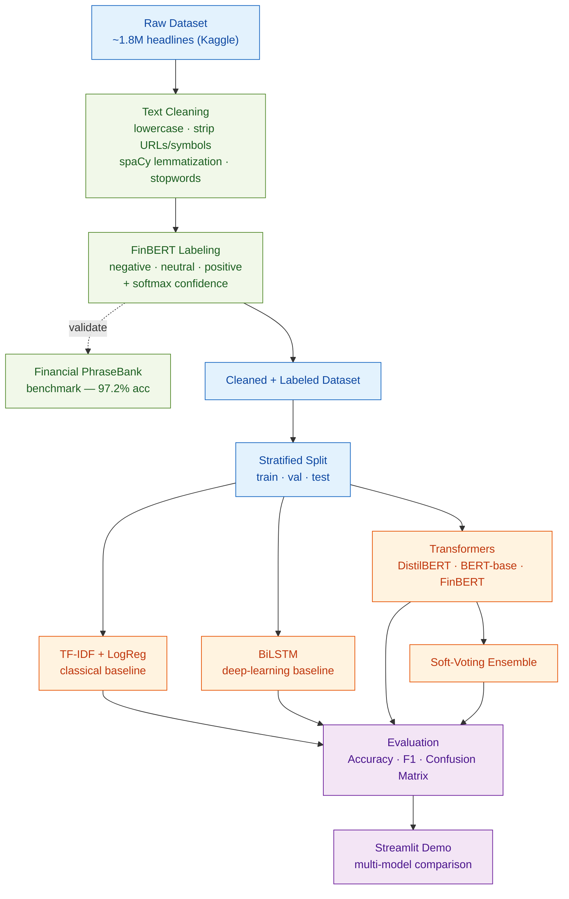

## Labeling & Validation

The raw dataset is **unlabeled**. We use **FinBERT** (`yiyanghkust/finbert-tone`) to generate pseudo-labels for all 1.8M headlines, then **validate** the labeling approach against the expert-annotated **Financial PhraseBank**, where FinBERT reaches **97.2% accuracy** — strong agreement with human labels.

| Class | Precision | Recall | F1 | Support |
|-------|:---------:|:------:|:--:|:-------:|
| negative | 0.906 | 0.983 | 0.943 | 303 |
| neutral  | 0.999 | 0.967 | 0.982 | 1391 |
| positive | 0.947 | 0.977 | 0.962 | 570 |
| **accuracy** | | | **0.972** | 2264 |

We additionally inspect FinBERT's **confidence distribution** to flag ambiguous headlines (see EDA below).

## Exploratory Data Analysis

**Sentiment distribution — benchmark vs. our dataset.** Both skew heavily *neutral*, reflecting the factual tone of financial reporting.

| Financial PhraseBank | Our 1.8M Dataset |
|:--:|:--:|
| 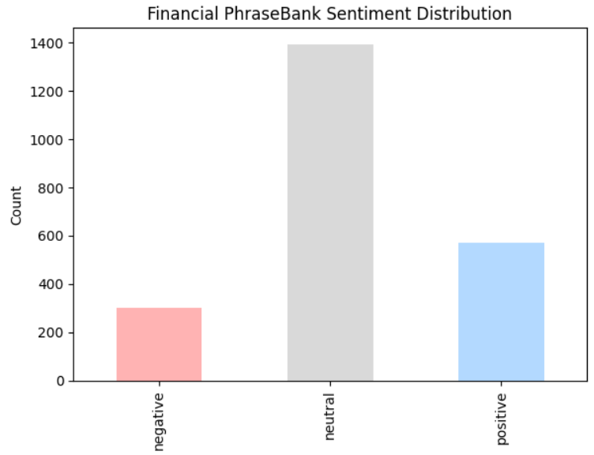 | 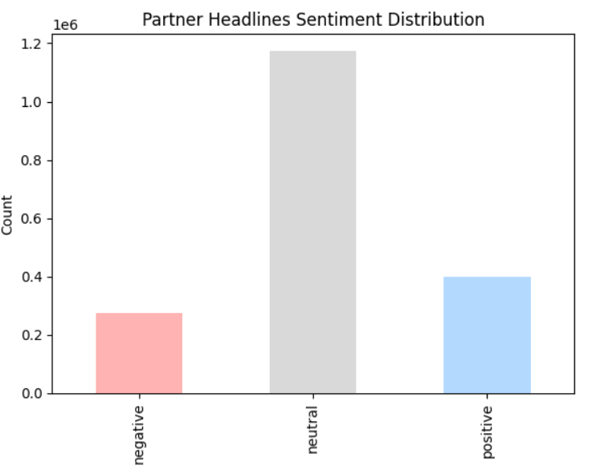 |

**Sentiment by publisher (top 5).** Tone varies sharply by outlet — e.g. *Born2Invest* skews entirely negative, while *Fox Business* and *GuruFocus* are predominantly neutral.

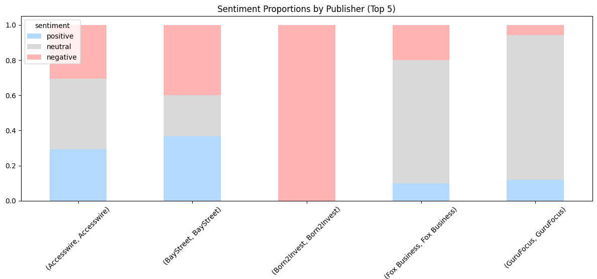

**Monthly sentiment over time.** Neutral consistently dominates; positive and negative volume both grow over the years.

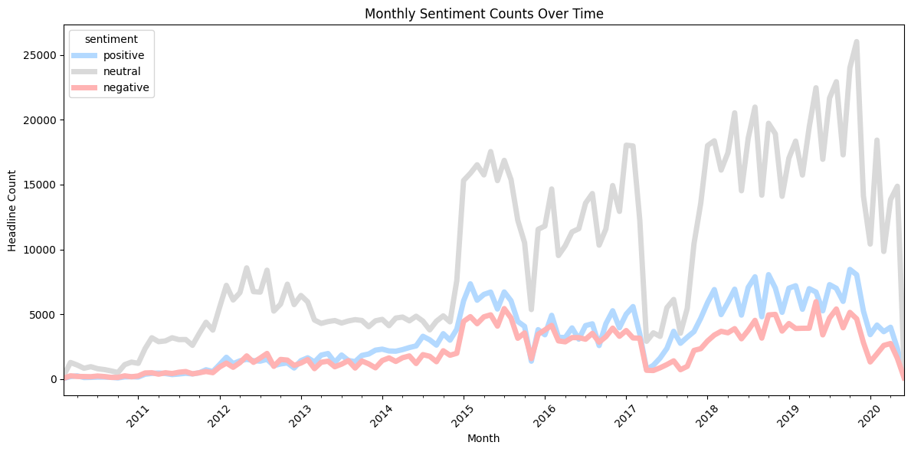

**Word clouds per class.** Positive: *earnings, beat, higher, revenue, dividend*. Negative: *downgraded, lower, decline, miss*. Neutral: *stock, analyst, report, CEO, portfolio*.

| Positive | Negative | Neutral |
|:--:|:--:|:--:|
| 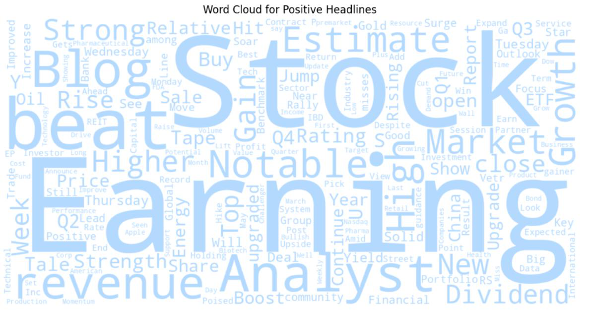 | 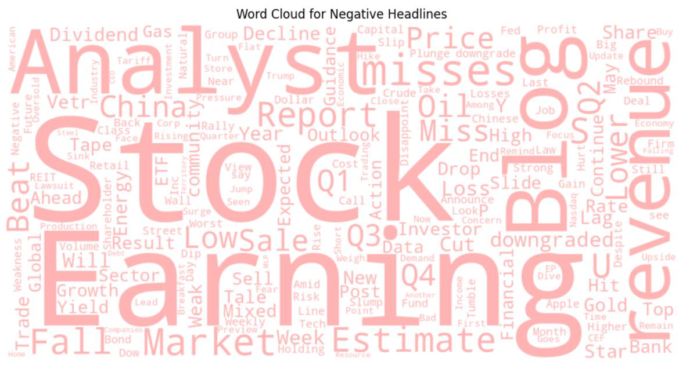 |  |

**FinBERT confidence distribution.** Most predictions exceed 0.85 confidence; only a small fraction fall below 0.6 (ambiguous / mixed-signal headlines).

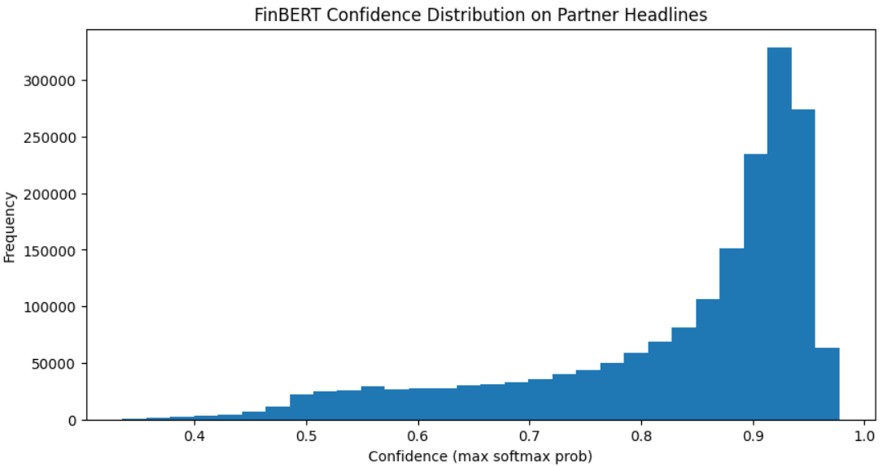

**Embedding structure (FinBERT + PCA).** Even reduced to 2 components, the three sentiment classes form largely separable regions — evidence that the pseudo-labels are grounded in real semantic structure.

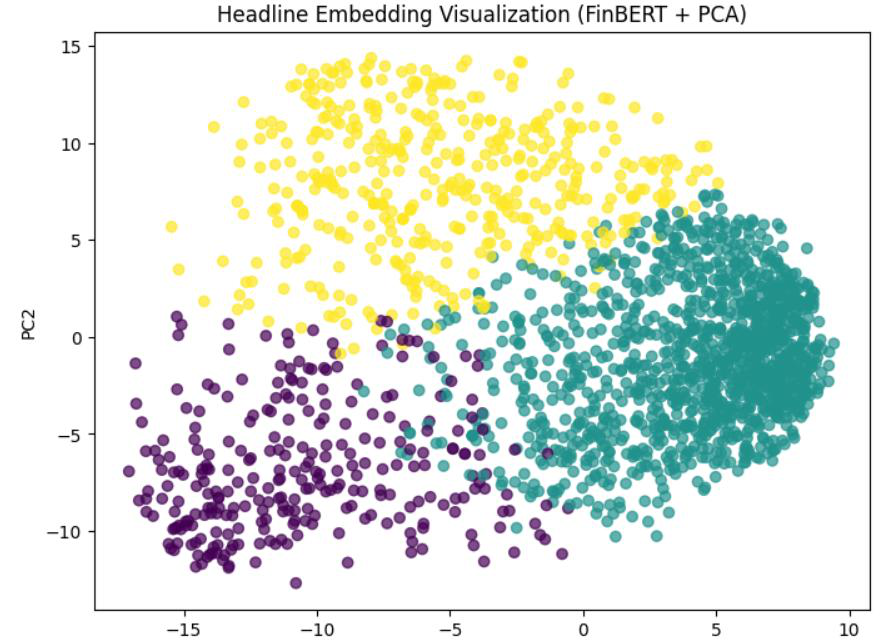

## Models & Results

We trained five models spanning classical ML, deep learning, and transformers. Transformers were fine-tuned for 3 epochs (AdamW, lr 2e-5, batch 32, max_len 64). Results on the **full 1.8M dataset**:

| Model | Validation Acc. | Test Acc. | Weighted F1 (Test) |
|-------|:---------------:|:---------:|:------------------:|
| TF-IDF + Logistic Regression | 0.82 | 0.80 | 0.80 |
| BiLSTM (Keras) | 0.91 | 0.90 | 0.90 |
| DistilBERT | 0.945 | 0.944 | 0.94 |
| BERT-base-uncased | 0.952 | 0.950 | 0.95 |
| **FinBERT (ProsusAI/finbert)** | **0.957** | **0.957** | **0.96** |
| Soft-voting Ensemble (3 transformers) | — | 0.955 | — |

**FinBERT is the strongest model.** Transformers clearly outperform classical baselines. The soft-voting ensemble (DistilBERT + BERT-base + FinBERT) landed at 0.955 — just below FinBERT alone, suggesting FinBERT already captures most of the useful signal.

**Speed (headlines/sec, 1k-sample inference test):** DistilBERT **3450** · FinBERT 2350 · BERT-base 2343. DistilBERT is ~1.5× faster (40% fewer params) — the classic speed/accuracy trade-off.

### Confusion matrices (DistilBERT, sample data)

| Counts | Normalized (per class) |
|:--:|:--:|
| 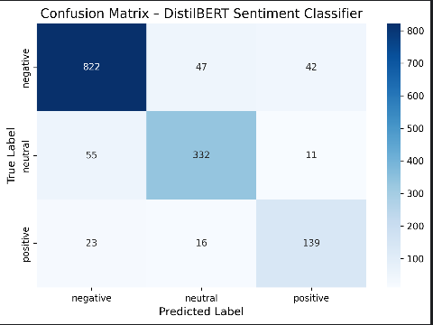 | 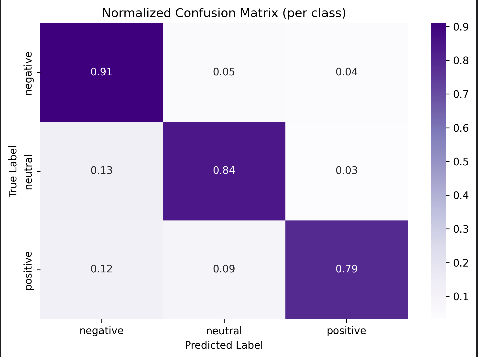 |

Negative (0.91) and neutral (0.84) are classified most reliably; **positive (0.79)** is the hardest class — positive sentiment is often expressed through subtle, forward-looking language.

## Error & Behavior Analysis

We probed the models on **contradictory / mixed-sentiment** headlines. All three transformers correctly prioritize financially harmful signals (losses, warnings) as negative. The interesting divergence: for *"The merger discussions have been paused indefinitely,"* DistilBERT/BERT predicted **negative**, while **FinBERT predicted neutral with 99.5% confidence** — treating "paused" as uncertainty rather than clear loss. This domain sensitivity helps explain FinBERT's edge.

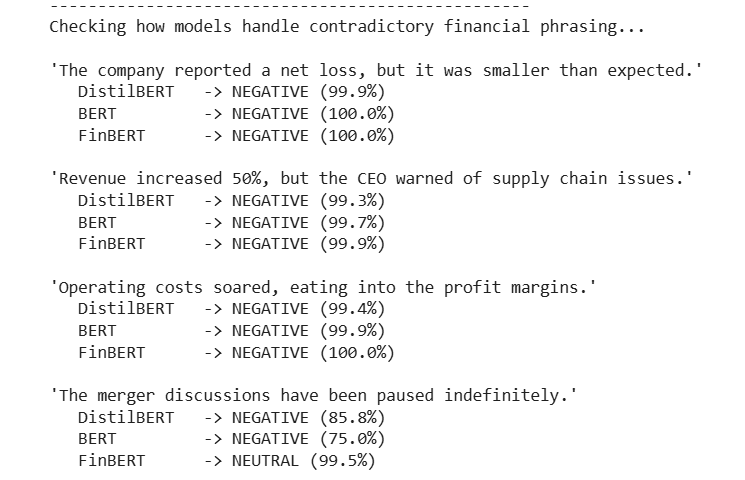

## Streamlit Demo

An interactive **"Financial Sentiment Lab"** app compares **Logistic Regression, DistilBERT, BERT-base, and FinBERT** on the same headline, showing each model's label and confidence. It can draw a random headline from the unseen test split (blind testing) and switch between the project dataset and Financial PhraseBank.

| Project data | Financial PhraseBank |
|:--:|:--:|
| 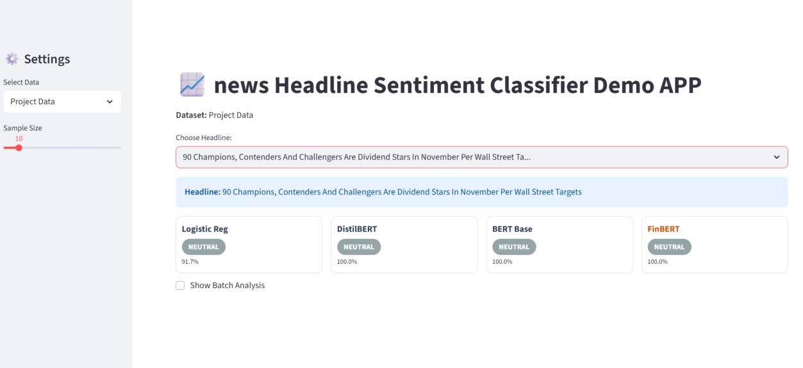 | 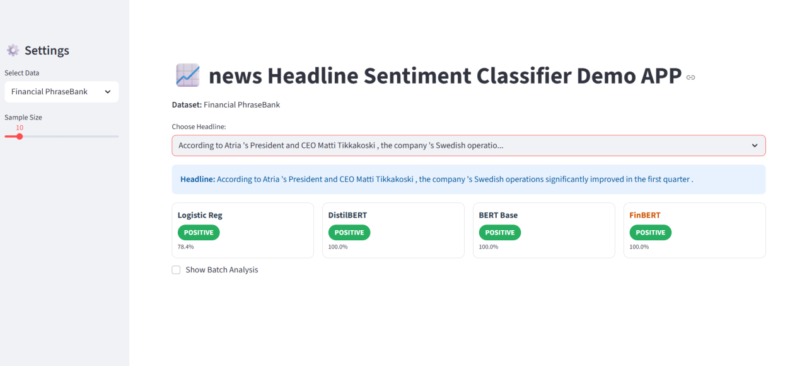 |

🎞️ **Walkthrough video:** https://www.loom.com/share/a39dedccda1741e284489ed3ed0f91ba

## Repository Structure

```
.
├── README.md
├── requirements.txt
├── notebooks/
│   └── full_pipeline.ipynb     # end-to-end final pipeline (Colab): EDA → labeling → 5 models → ensemble → demo
├── src/                        # early 10k-sample prototype scripts (PyCharm phase)
│   ├── 1_preprocessing_eda.py
│   ├── 2_train_models.py
│   └── app_streamlit.py
├── docs/
│   ├── final-group-project-report.pdf
│   ├── NLP Project Final Presentation.pptx
│   └── images/                 # figures used in this README
└── data/                       # datasets (gitignored — download from Kaggle/Drive)
```

> **Note:** `notebooks/full_pipeline.ipynb` is the **final** project (full 1.8M dataset, all five models, ensemble, and the multi-model demo). The scripts in `src/` are the **earlier 10k-row prototype** kept for reference. Trained models and the full datasets live on Google Drive and are not committed.

## How to Run

```bash
# 1. Install dependencies
pip install -r requirements.txt
python -m spacy download en_core_web_sm

# 2. Final pipeline (recommended): open the notebook in Google Colab
#    notebooks/full_pipeline.ipynb  — set the runtime to a GPU, then run all cells.
#    It expects the dataset and a working directory on Google Drive.

# 3. (Optional) Reproduce the early prototype locally
#    Place raw_partner_headlines.csv (renamed raw_headlines_data.csv) in data/, then:
python src/1_preprocessing_eda.py      # clean + FinBERT-label a 10k sample
python src/2_train_models.py           # LogReg baseline + fine-tune DistilBERT
streamlit run src/app_streamlit.py     # single-model demo (needs the trained model)
```

## Conclusions & Future Work

- **Scaling to the full dataset mattered.** The 10k sample under-represented financial-language diversity (especially positive sentiment); the full 1.8M corpus markedly improved reliability.
- **Benchmark validation is essential.** Comparing against the human-annotated Financial PhraseBank confirmed FinBERT was a trustworthy teacher model.
- **Domain-specific transformers win.** FinBERT delivered the best accuracy and the most nuanced handling of ambiguous financial phrasing.

**Future directions:** add a small human-annotated validation set; expand beyond the 3-class scheme to finer-grained sentiment / intensity; explore event-based tagging (earnings, M&A, regulatory); and evaluate or pretrain additional finance-specific transformers.

---

